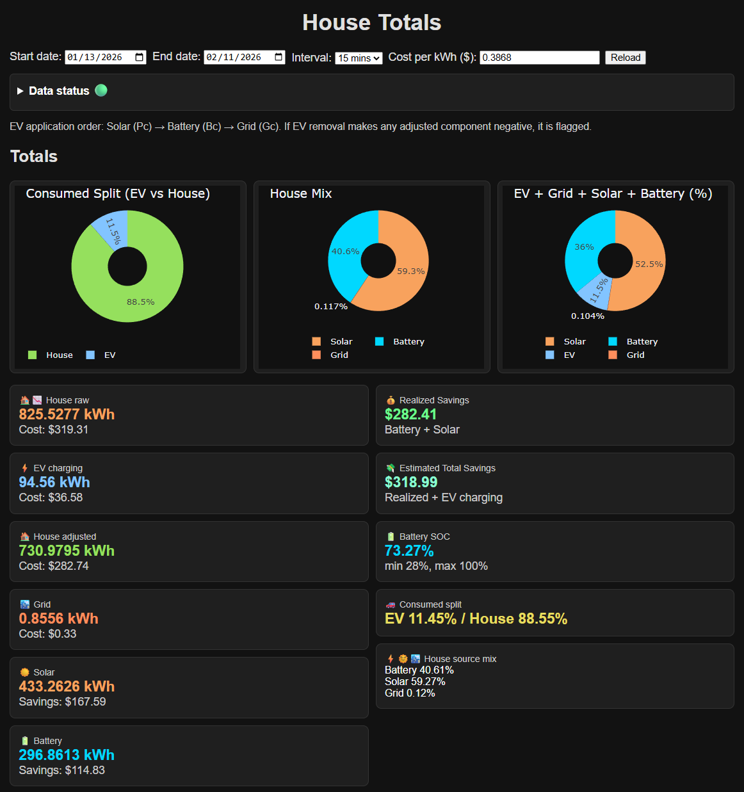

# VictronSolar

## Description
 - Small project to visualize EV and House power consumption.
 - Attempting to write code mainly with AI generated code.
 - Includes estimated electricity costs and savings from solar and batteries.
 - Attempts to remove EV power from totals reported from Cerbo so you can see how much power the EV is using and how much the rest of the house is using.
 - Also includes battery charging sources and Battery State of Charge
 - Adjustable dates and time intervals as well as Cost per kWh



## Environment requirements
Requires .env file with the following values
```
VRM_USERNAME=[username]
VRM_PASSWORD="[password]"
VRM_DAYSPAST=30'
```
## Web UI
A small Flask app can display interactive graphs from live Victron API data.

1. Install the Python dependencies (use the provided virtualenv or your own):
   ```sh
   python -m pip install -r requirements.txt
   ```
2. Start the web server:
   ```sh
   export FLASK_APP=src/VRM/app.py
   flask run
   ```
4. Visit http://127.0.0.1:5000/ in your browser and you should see a dashboard.

You can also launch the app directly with `python src/VRM/app.py` when
`debug=True` is acceptable.
## main.py
Executing the main.py with `python src/VRM/main.py` will create json files in the project `output/*.json` folder.